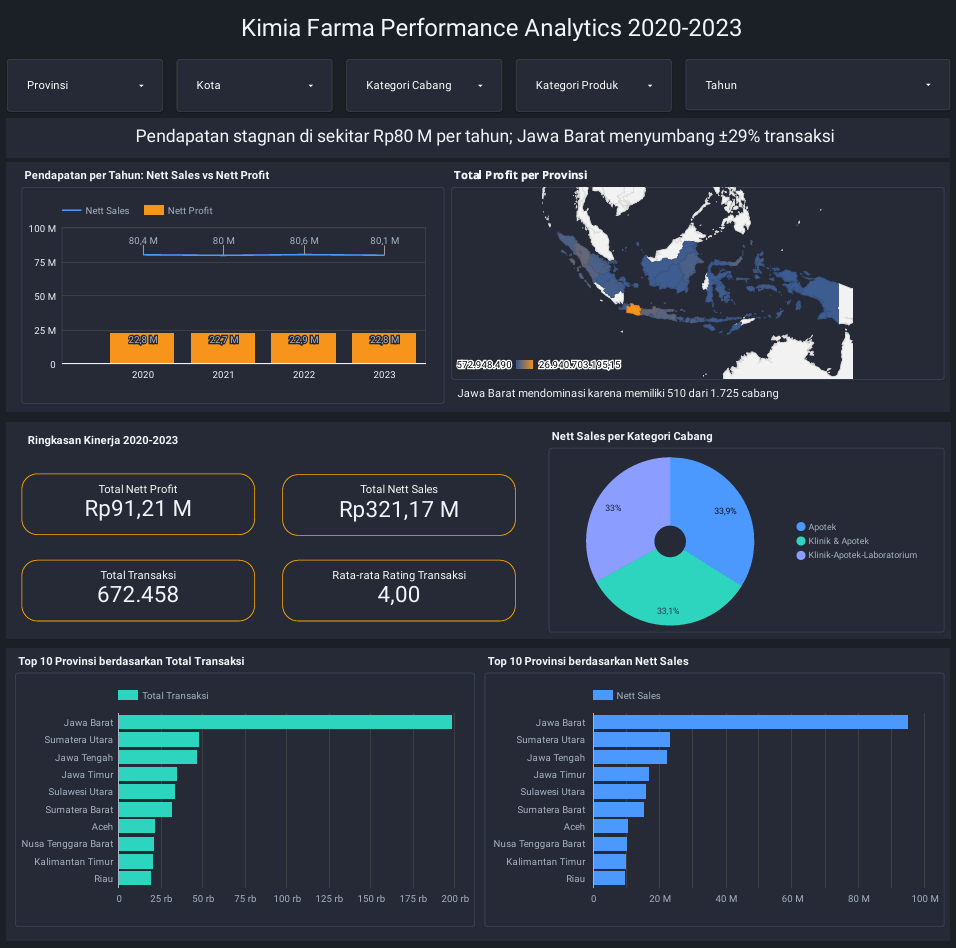
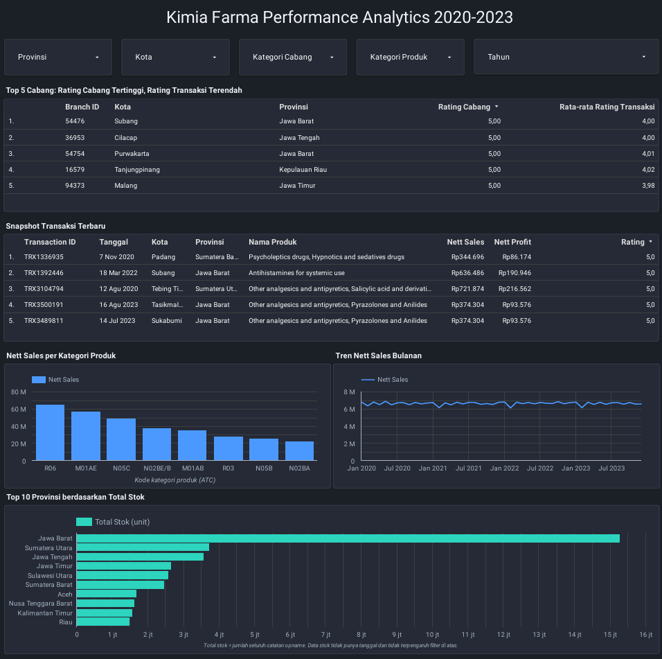

# Kimia Farma Performance Analytics 2020–2023
**Project-Based Virtual Internship — Big Data Analytics**
PT. Kimia Farma x Rakamin Academy | April–May 2025

---

## Project Overview

### Page 1 — Overview


### Page 2 — Details


Kimia Farma, one of Indonesia's largest pharmaceutical companies, needed a data-driven approach to evaluate business performance across its branches nationwide. This project imports four datasets into Google BigQuery, builds an integrated analysis table with SQL, and delivers a performance dashboard covering 2020–2023.

---

## Objectives

- Import and integrate 4 datasets into Google BigQuery
- Build a unified analysis table using SQL JOINs and CASE WHEN logic
- Analyze sales performance, profitability, and service quality across branches
- Identify regional trends and deliver actionable recommendations

---

## Repository Structure

```
├── README.md
├── sql/
│   ├── 01_load_tables.sh                 # import 4 CSV files (explicit schema)
│   ├── 02_create_tabel_analisa.sql       # analysis table + branch stock summary
│   └── 03_validation_and_insights.sql    # validation checks + analysis queries
└── dashboard/
    ├── overview.png
    └── details.png
```

---

## Dataset Structure

| File | Rows | Description |
|------|------|-------------|
| kf_final_transaction.csv | 672,458 | Transaction data (date, product, discount, transaction rating) |
| kf_product.csv | 150 | Product information (name, category, price) |
| kf_inventory.csv | 1,035,000 | Stock opname per branch and product |
| kf_kantor_cabang.csv | 1,725 | Branch details (location, branch rating) |

---

## Tools Used

- **Google BigQuery** — dataset import, SQL, table creation
- **Data Studio (formerly Looker Studio)** — interactive dashboard
- **SQL** — multi-table JOINs, CASE WHEN, aggregation

---

## Methodology

The analysis table `kimia_farma.tabel_analisa` joins transactions with branch and product data (full query in [`sql/02_create_tabel_analisa.sql`](sql/02_create_tabel_analisa.sql)).

**Gross profit tiers (by price):**

| Price | Gross profit |
|-------|--------------|
| ≤ Rp 50,000 | 10% |
| > Rp 50,000 – 100,000 | 15% |
| > Rp 100,000 – 300,000 | 20% |
| > Rp 300,000 – 500,000 | 25% |
| > Rp 500,000 | 30% |

```
nett_sales  = actual_price × (1 − discount_percentage)
nett_profit = nett_sales × persentase_gross_laba
```

**Data preparation notes**
- `date` is stored as `M/D/YYYY` text, so it is loaded as STRING and converted with `PARSE_DATE('%m/%d/%Y', date)`.
- `discount_percentage` is already a decimal (0.05 = 5%), so it is **not** divided by 100.
- `branch_name` has only 3 distinct values, so branches are identified by `branch_id` + `kota`.
- `kf_inventory` is **not** joined directly to transactions: the same (branch, product) pair repeats many times, so a direct join would duplicate transaction rows and inflate sales. Stock is summarized separately in `tabel_stok_cabang`.
- Province ISO codes (`provinsi_iso`) were added to draw the geo map accurately.
- Validation: 672,458 rows, 0 null dates, 0 unmatched branches or products.

---

## Dashboard Summary

**Key metrics (2020–2023)**
- Total transactions: 672,458
- Nett sales: Rp 321.17 billion
- Nett profit: Rp 91.21 billion
- Average transaction rating: 4.0
- Unique customer names: 264,601
- Products: 150 · Branches: 1,725 across 31 provinces

**Nett sales per year**

| Year | Nett sales | Nett profit |
|------|-----------|-------------|
| 2020 | Rp 80.44 B | Rp 22.84 B |
| 2021 | Rp 80.04 B | Rp 22.73 B |
| 2022 | Rp 80.58 B | Rp 22.88 B |
| 2023 | Rp 80.12 B | Rp 22.76 B |

**Top 5 provinces by nett sales**
1. Jawa Barat — Rp 94.87 B
2. Sumatera Utara — Rp 22.95 B
3. Jawa Tengah — Rp 22.25 B
4. Jawa Timur — Rp 16.63 B
5. Sulawesi Utara — Rp 15.90 B

**Top 5 provinces by transaction volume**
1. Jawa Barat — 198,723
2. Sumatera Utara — 48,178
3. Jawa Tengah — 46,494
4. Jawa Timur — ~34,800
5. Sulawesi Utara — ~33,300

**Branches with the highest branch rating (5.0) but lowest transaction rating**

| Branch ID | City | Province | Avg. transaction rating |
|-----------|------|----------|-------------------------|
| 82157 | Tarakan | Kalimantan Utara | 3.91 |
| 44567 | Batam | Kepulauan Riau | 3.93 |
| 13775 | Tomohon | Sulawesi Utara | 3.93 |
| 31872 | Pangkalpinang | Bangka Belitung | 3.93 |
| 62707 | Mataram | Nusa Tenggara Barat | 3.96 |

96 branches tie at rating 5.0, so the ranking is decided by the lowest average transaction rating.

---

## Key Insights

- **Revenue is flat.** Nett sales stay around Rp 80 billion every year and Rp 6.2–6.9 billion per month from January 2020 to December 2023. There is no growth trend.
- **Jawa Barat dominates, mainly through branch count.** It generates about 30% of all transactions (198,723) and holds 510 of 1,725 branches (about 30%). Its share follows its branch network, not higher productivity per branch.
- **Profit depends on high-priced products.** About 52% of transactions are priced above Rp 500,000 (30% gross profit tier). Profit is calculated from fixed price tiers, so the data cannot show real cost efficiency.
- **Service gap at top-rated branches.** The 5 branches above have a perfect branch rating but average transaction ratings of only about 3.9, below the overall average of 4.0.
- **Stock follows branch count, not sales.** Total recorded stock is 51.7 million units, and stock per branch is almost identical in every province (about 29,300–30,500 units).

---

## Recommendations

**1. Regional growth strategy**
Revenue is stuck at about Rp 80 B per year. Focus campaigns on mid-tier provinces (Jawa Timur, Sulawesi Utara) and test whether adding branches or improving branch productivity closes the gap with Jawa Barat.

**2. Branch service quality**
Investigate transaction flow at the high-rated branches with low transaction ratings (starting with Tarakan and Batam). Add staff training or process improvements so service matches branch reputation.

**3. Product mix**
With more than half of transactions in the highest price tier, protect availability and pricing of high-value products and review discounting on them.

**4. Inventory allocation**
Stock per branch is nearly uniform, so allocation does not reflect demand. Reallocate stock based on sales per branch, and track stock over time (the inventory data has no date).

---

## Limitations

- The data is highly uniform across years and provinces and may be synthetic, so conclusions should be treated as indicative.
- `nett_profit` is derived from fixed price tiers, not actual costs.
- Inventory has no date and contains repeated (branch, product) records, so total stock is the sum of all opname records, not exact physical stock.
- The stock chart is not affected by dashboard filters because it uses a separate table.

---

## Author

**Refa Defanda Witanto**

International Relations, Universitas Brawijaya

[LinkedIn](https://www.linkedin.com/in/refa-defanda/) | refadfnda@gmail.com
